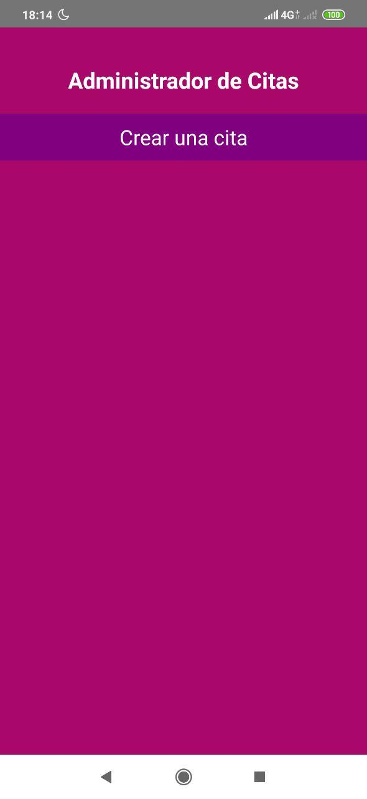
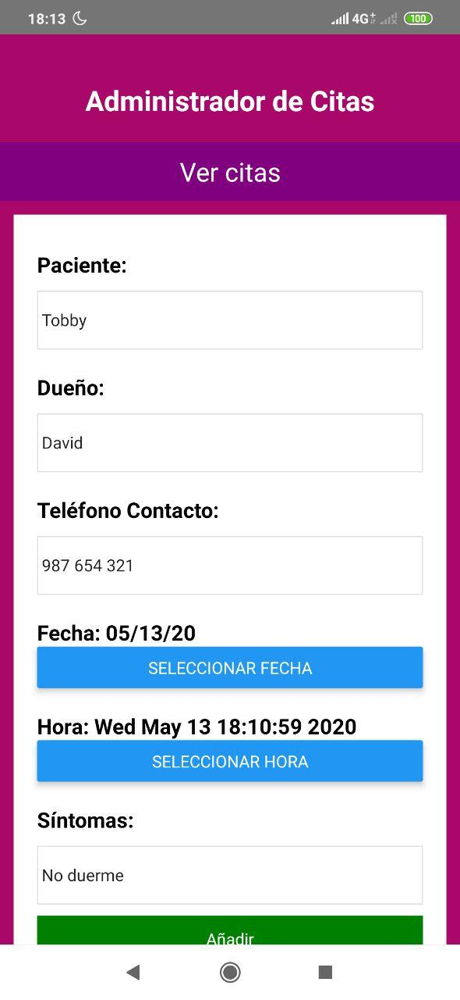
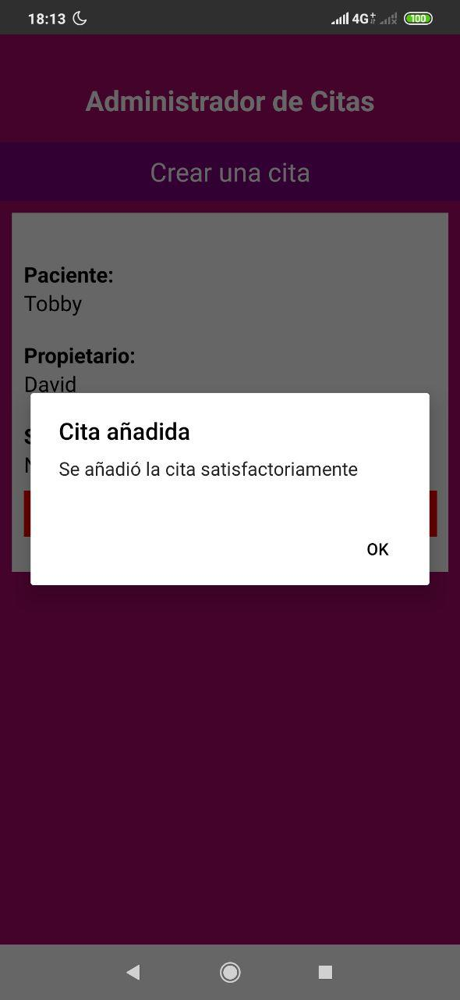
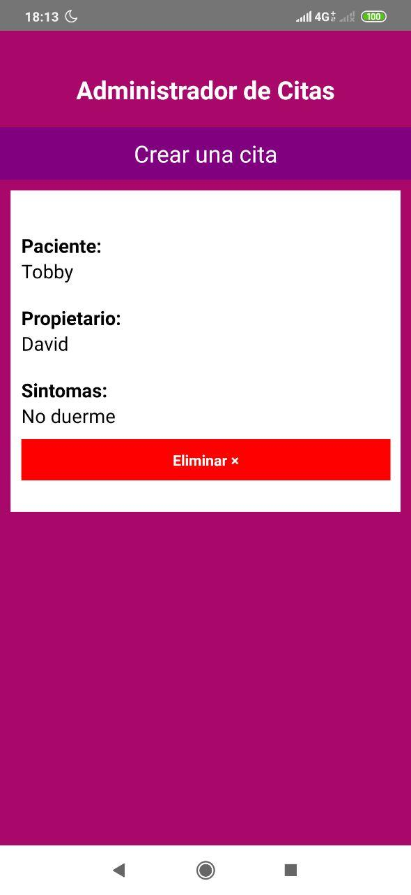
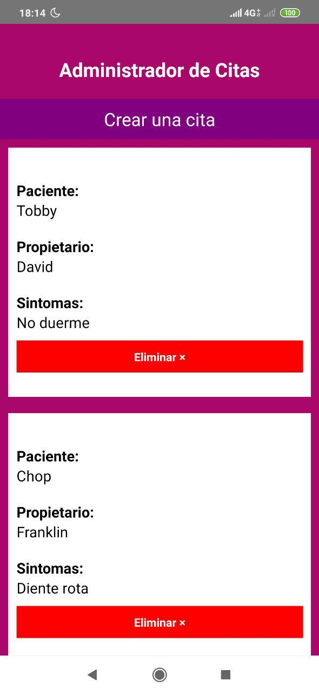

# Ejemplo de aplicación de citas médicas en React Native.

Ejemplo muy básico para empezar con React Native. Es una aplicación de una sola pantalla donde se ponen en práctica los conceptos de React.JS en React Native.

### Actualización: Async Storage

Se integra Async Storage para guardar las citas en la memoria del movil.

### Screen

